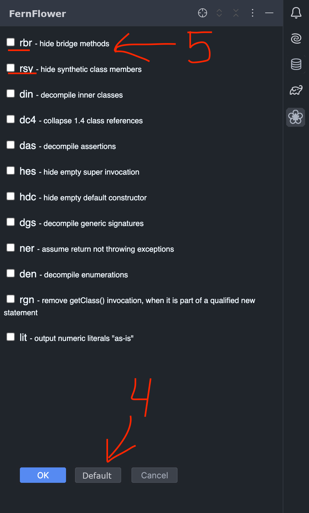

## Task 1
**_Why are you interested in this project?_**

Firstly, I like low-level stuff, and especially a JVM stack because I consider it like a future 
field of working on. And your internship is strongly related to it.
Secondly, my friend really recommended this team, and I will get great experience working in it.
And thirdly, this is a great chance to work on real tasks, and get real experience of working. 

## Task 2 
**_How do you think the UI should look like for letting users set the decompilation mode in
IntelliJ IDEA? Do you think we should add a button? If so, where? Please motivation your answer and
feel free to add screenshots and drawings to clarify your solution._**

In my opinion, a good way to do it is to create an interface similar to README. 

1. You may click on any `.class` or `.jar` file, and it will decompile in default mode.
Also `.jar` file could contain more than one `.class` file, so when you click on the `.jar` file,
you will get a drop-down menu with all `.class` files, where you should choose one to look at.
2. In the top right corner, there are two buttons with predefined decompiling settings. 
And here is a similarity to README.
   (For some reason, I drew only two predefined modes instead of three.)
3. Also, if you want some advanced control under decompiling, you may click on this icon and you resieve
the following menu: 



4. There we have a button that restores all default fernflower properties.
5. For each of the fernflowers properties we have a checkbox, witch enables or disables a property.
   (I didn't draw all properties here, but I guess it is understandable what is going to be there.)

In my opinion, this design integrates well in current IntelliJ IDEA design. And also it satisfies all
features requirements.

## Task 3
**_For this test task, please change `FernFlower` in such a way that it doesn't generate
the redundant constructor and accessors for record classes._**
## Solution
First of all, I looked at `ClassWriter` class as were suggested but 
at first understood nothing. Then, I decided to launch `ConsoleDecompiler` class
in debug mode and figure out what is going on step by step.

After few attempts I found out that `StructContext` is the class, which constructs
all classes from bytecode. All magic happened here:
```java
if (filename.endsWith(".class")) {
    try (DataInputFullStream in = loader.getClassStream(file.getAbsolutePath(), null)) {
      StructClass cl = StructClass.create(in, isOwn, loader);
      classes.put(cl.qualifiedName, cl);
      ...
```
And if we go deeper to the `StructClass.create()` we could find 
this line of code: 
```java
ConstantPool pool = new ConstantPool(in);
```
Then we construct class representation. 
In my opinion, this is a crucial part of decompiling, because we will use these tokens to construct 
an abstract syntax tree.

Finally, we could move to this line `decompiler.decompileContext();` 
in `ConsoleDecompiler` and start constructing decompiled code. This method
launches a lot of different methods form other classes to parse constructed class and 
make an abstract syntax tree (AST).

After this, we use this AST restore compiled code. I will focus only on `ClassWriter`,
which is the most important for us in our task.

In this class, there is "main" method `classToJava()`. And there, we could find a 
`methodToJava()` method, which restores method. Therefore, at this point, 
I realize that I should work in this function.

#### _Reminder: or goal is to remove "redundant" methods from record classes._

I found out that you may hide the method if it satisfies some condition: 
```java
hideMethod = code.length() == 0 &&
  (clInit || dInit || hideConstructor(node, !typeAnnotations.isEmpty(), init, throwsExceptions, paramCount, flags)) ||
  isSyntheticRecordMethod(cl, mt, code);
```
And the most convenient way to hide redundant record methods is to mark them as "hidden"
in this function: 
```java
private static boolean isSyntheticRecordMethod(StructClass cl, StructMethod mt, TextBuffer code)
```
After a few debug attempts, I figured out how methods were constructed and started implementing my
main goal of the task.
## My implementation:
I added two functions to remove getters and primary constructor:
```java
private static boolean isDefaultGeneratedRecordGetMethod(StructClass cl, StructMethod mt, TextBuffer code) {
  String methodName = mt.getName();
  List<StructField> fields = cl.getFields();

  for (StructField fd : fields) {
    if (fd.getName().equals(methodName) && mt.getDescriptor().equals("()" + fd.getDescriptor()) && code.countLines() == 1) {
      String str = code.toString().trim();
      return str.startsWith("return this." + fd.getName() + ";");
    }
  }
  return false;
}
private static boolean isDefaultGeneratedRecordInit(StructClass cl, StructMethod mt, TextBuffer code) {
  StringBuilder expectedType = new StringBuilder("(");
  List<StructField> fields = cl.getFields();

  for (StructField fd : fields) {
    expectedType.append(fd.getDescriptor());
  }
  expectedType.append(")V");
  if (mt.getName().equals("<init>") && mt.getDescriptor().contentEquals(expectedType) &&
    code.countLines() == cl.getFields().size()) {
    String str = code.toString().trim();
    int i = 0;
    for (String line : str.split("\n")) {
      line = line.trim();
      if (!line.startsWith("this." + fields.get(i) + " = " + fields.get(i) + ";")) {
        return false;
      }
      i++;
    }
    return true;
  }
  return false;
}
```
Also, I did a bonus task and implemented control `-src` option for `fernflower`.
(Which states for Simplify Record Classes) By default it is `0`.
Here is my implementation:
```java
if (DecompilerContext.getOption(IFernflowerPreferences.SIMPLIFY_RECORD_CLASSES)) {
  return isDefaultGeneratedRecordGetMethod(cl, mt, code) ||
    isDefaultGeneratedRecordInit(cl, mt, code);
}
```


